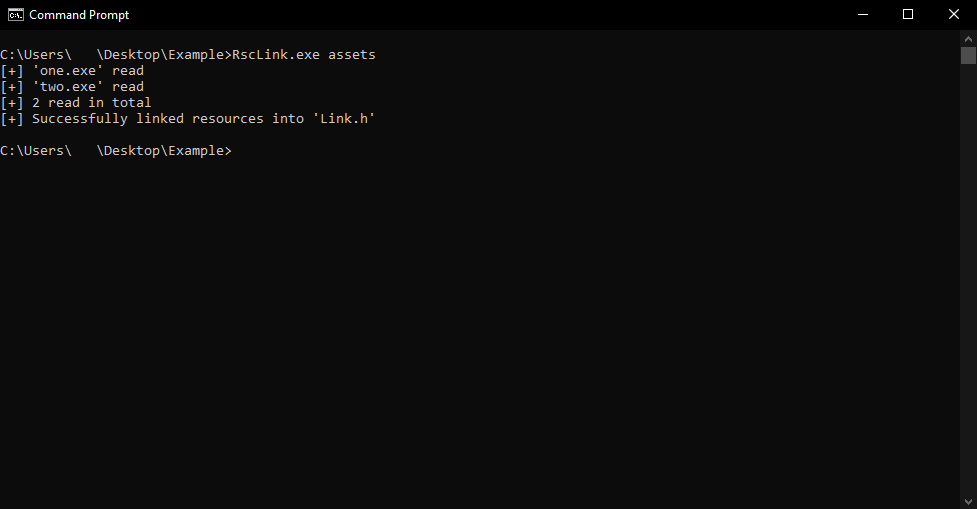
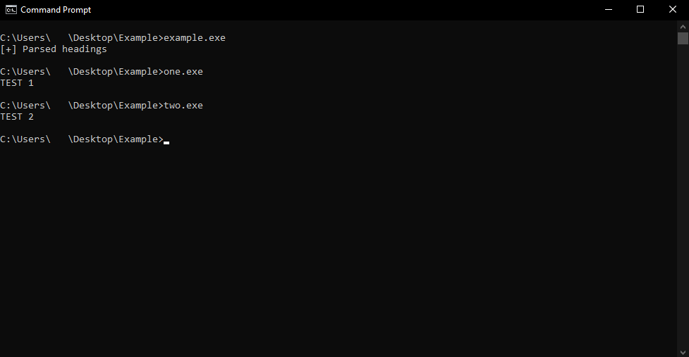

<h1 align="center">
    <picture>
        <source srcset="./repo/logo-txt-dark.svg"  media="(prefers-color-scheme: dark)">
        
    </picture>
</h1>

<p align="center">Static resource linker for your C++ projects.</p>

## Example

For this example there is a project in which the following structure:

```
│-- main.cpp
│-- RscLink.exe
│-- RscLink.h
├───assets
│   │--- one.exe
│   │--- two.exe
```

The source code of `main.cpp` is the following:

```c++
#include <fstream>

#include "RscLink.h"
#include "Link.h"

int main()
{
	RscLink resources(const_cast<uint8_t*>(link_heading), LINK_HEADING_SIZE, const_cast<uint8_t*>(link_data), LINK_DATA_SIZE);

	std::ofstream test1("one.exe", std::ios::trunc | std::ios::binary);
	auto entry{ resources["one.exe"] };
	test1.write(reinterpret_cast<char*>(entry.ptr), entry.size);
	test1.close();

	std::ofstream test2("two.exe", std::ios::trunc | std::ios::binary);
	auto entry_two{ resources["two.exe"] };
	test2.write(reinterpret_cast<char*>(entry_two.ptr), entry_two.size);
	test2.close();

	return 0;
}
```

I will generate `Link.h` as follow: 



Now after building the project and executing the program, it outputs the two executables that were linked into `Link.h`, and I can now run them with no problem as follow:



## Building

Head into `cmake/`, and read the `README.md` to build the linker.

